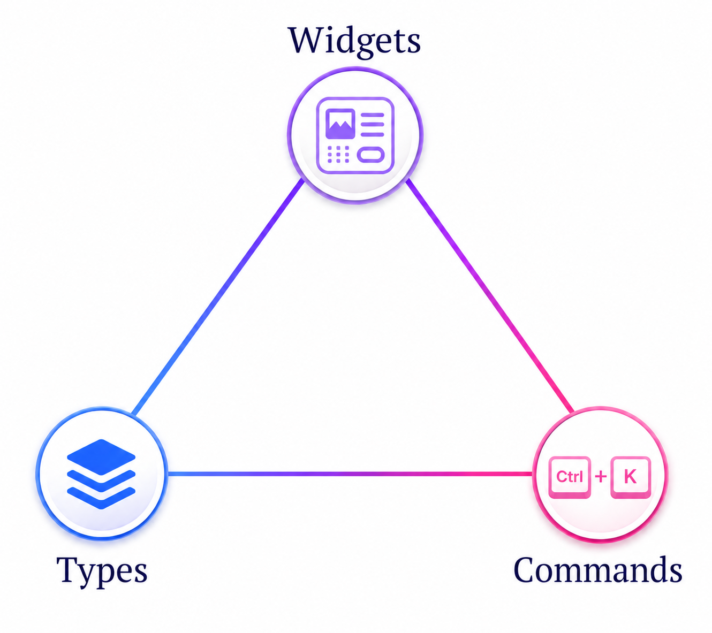

 # Tree Editor (TE)

  

Features:
 - editing commands
 - output tree with widgets (updates as you edit)
 - type system (updates as you edit)
 - import/export of text, JSON, and XML
 - built-in manual

Usage:

    cd tree-editor
    npm install
    node .

then visit [http://localhost:7433](http://localhost:7433)